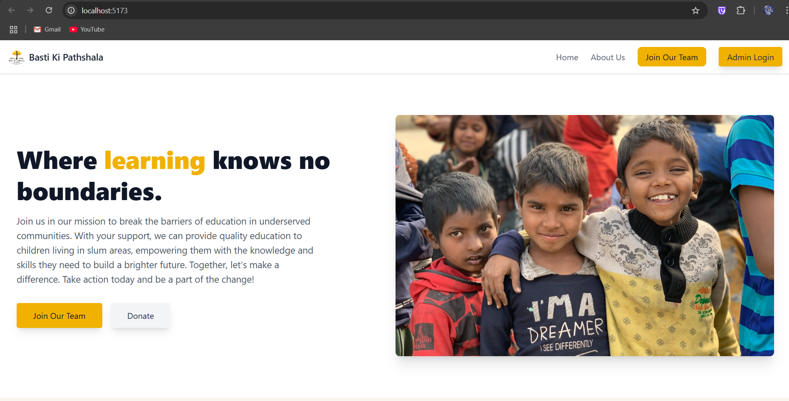
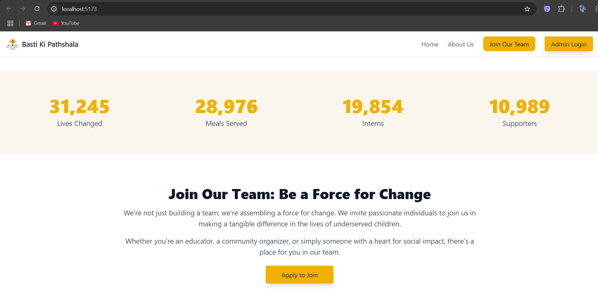
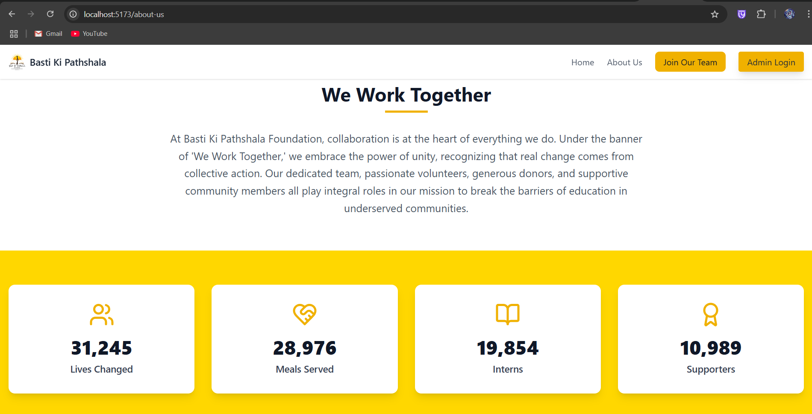
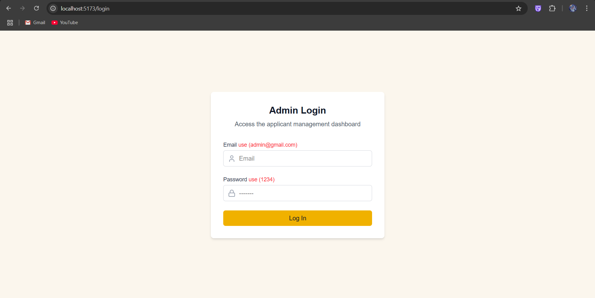
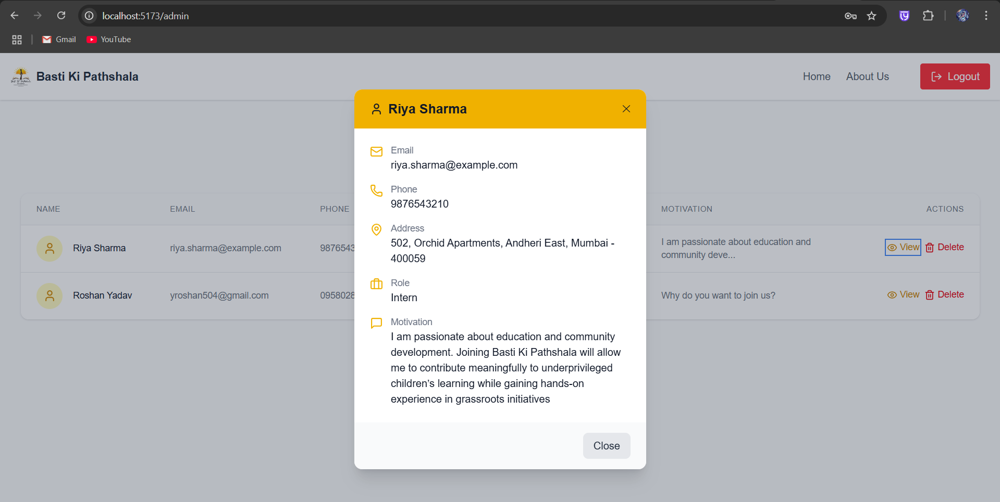

# Basti Ki Pathshala 🌱

This is a full-stack web application built for **Basti Ki Pathshala Foundation**. The app allows users to view information about the organization, register as a volunteer or intern, and enables admins to manage applications via a dashboard.


-----

## 🚀 Live Demo

- **Vercel Live Website Link :** [ Basti Ki Pathshala](https://basti-ki-pathshala-iota.vercel.app/)

## ⚠️ Note About Backend (Render)

 The backend is hosted on **Render**, which **sleeps after 15 minutes of inactivity** on the free plan.

- If you see errors like _"Failed to fetch"_ or _server unavailable_, it's likely because the backend is waking up.
- **Please wait 1–2 minutes and try again.**
- The backend will auto-redeploy and the app will work normally once it's live again.

-----
## 📂 Features

- 🏠 Home page with branding
- 📖 About Us section
- 📝 Volunteer/Intern Registration Form
- 🔐 Admin login and authentication
- 📋 Admin panel to view and manage all applications
- ⚡ Toast notifications for actions (login/logout/submit)
- 🎨 Clean, mobile-responsive UI

----

## Tech Stack

  * **Frontend:** React.js, Tailwind CSS, React Router DOM, Zustand (for state management), Lucide React (icons), React Hot Toast.
  * **Backend:** Node.js, Express.js, Mongoose (for MongoDB ODM), jsonwebtoken (JWT), 
  * **Database:** MongoDB (ideally MongoDB Atlas for cloud hosting).
  * **Authentication:** JWT (JSON Web Tokens).

----

## Getting Started

Follow these steps to set up and run the project locally.

### Prerequisites

  * Node.js (v18+) and npm installed.

### Backend Setup

1.  **Clone the repository:**
    ```bash
    git clone https://github.com/Roshan-504/Basti-Ki-Pathshala.git
    cd Basti-Ki-Pathshala/backend
    ```
2.  **Install dependencies:**
    ```bash
    npm install
    ```
3.  **Run the backend server:**
    ```bash
    npm start
    ```
    The backend server will typically run on `http://localhost:3000`.

### Frontend Setup

1.  **Open a new terminal and Navigate to the frontend directory:**
    ```bash
    cd Basti-Ki-Pathshala/frontend 
    ```
2.  **Install dependencies:**
    ```bash
    npm install
    ```
3.  **Run the frontend development server:**
    ```bash
    npm run dev
    ```
    The frontend application will typically open in your browser at `http://localhost:5173`.

----

## 📸 Screenshots

### 🏠 Homepage



### 📖 About Us Section


### 📝 Volunteer/Intern Form


### 🔐 Admin Login Page


### 📋 Admin Dashboard (Applicants List)


### 📋 Applicants Details

